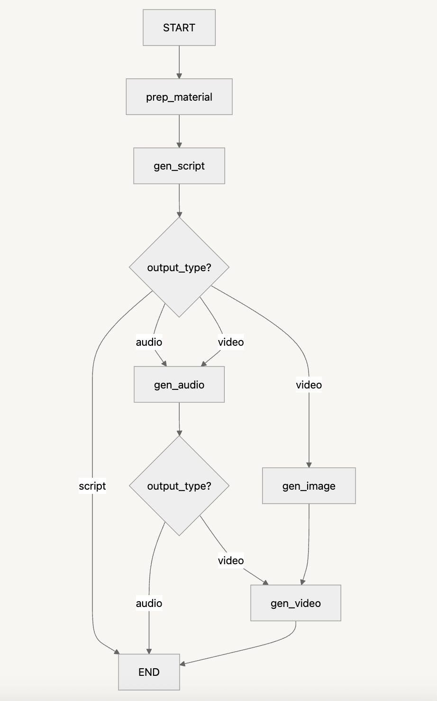
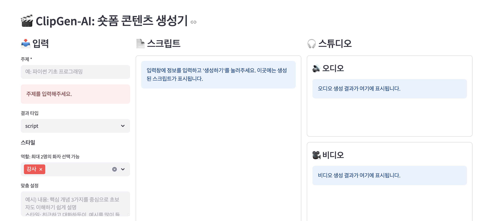

# 🎬 ClipGen AI

> **AI 기반 자막, 오디오, 숏폼 영상 콘텐츠 자동 생성 시스템**

LangGraph 멀티에이전트 아키텍처를 활용하여 다양한 소스 자료로부터 완전 자동화된 콘텐츠를 생성하는 프로젝트입니다.


## 🌟 프로젝트 개요

ClipGen AI는 PDF 문서, 웹 검색 결과 등을 종합하여 스크립트를 생성하고, 이를 바탕으로 오디오와 영상까지 자동 생성하는 콘텐츠 제작 AI 입니다.

### 🎯 주요 기능
- 📄 **다중 소스 자료 수집**: PDF, 웹 검색, 텍스트 입력
- 🤖 **AI 스크립트 생성**: 수집된 자료를 기반으로 구조화된 스크립트 생성
- 🎵 **TTS 오디오 생성**: 생성된 스크립트를 자연스러운 음성으로 변환
- 🖼️ **AI 이미지 생성**: 콘텐츠에 맞는 시각적 자료 생성
- 🎥 **비디오 렌더링**: 자막, 오디오, 이미지를 결합한 최종 영상 생성

## 🏗️ LangGraph 멀티에이전트 아키텍처

### 시스템 구조


### 🤖 에이전트 구성

#### 1. **Material Preparation Agent** (`prep_material`)
- **역할**: 다양한 소스에서 자료를 수집하고 전처리
- **도구들**:
  - `ReadPdfTool`: PDF 문서 텍스트 추출 및 구조화
  - `WebSearchTool`: 주제 관련 웹 검색으로 최신 정보 수집
- **출력**: 통합된 자료 목록 (타입별 분류 및 인용 번호 포함)

#### 2. **Script Generation Agent** (`gen_script`)
- **역할**: 수집된 자료를 바탕으로 구조화된 스크립트 생성
- **핵심 기능**:
  - 주제별 콘텐츠 구성 및 논리적 흐름 설계
  - 역할별(발표자, 진행자 등) 대화 스크립트 생성
  - 사용자 커스텀 설정 반영 (톤앤매너, 스타일 등)
- **출력**: JSON 형태의 구조화된 스크립트 파일

#### 3. **Audio Generation Agent** (`gen_audio`)
- **역할**: TTS를 활용한 고품질 음성 생성
- **기능**: 스크립트를 자연스러운 음성으로 변환
- **출력**: MP3 오디오 파일

#### 4. **Image Generation Agent** (`gen_image`)
- **역할**: 콘텐츠에 맞는 시각적 자료 생성
- **기능**: 스크립트 내용 기반 AI 이미지 생성
- **출력**: 고해상도 PNG 이미지 파일들

#### 5. **Video Generation Agent** (`gen_video`)
- **역할**: 최종 영상 렌더링 및 후처리
- **기능**: 자막, 오디오, 이미지를 결합한 완성된 비디오 생성
- **출력**: 편집된 MP4 영상 파일

## 🛠️ 기술 스택

### 핵심 프레임워크
- **LangGraph**: 멀티에이전트 워크플로우 오케스트레이션
- **LangChain**: LLM 체인 구성 및 도구 통합

### 주요 라이브러리
```python
# requirements.txt 주요 의존성
langgraph>=0.2.0          # 멀티에이전트 그래프 구성
langchain-core>=0.3.0     # LLM 체인 및 도구 통합
langchain-openai>=0.2.0   # Azure OpenAI 연동
asyncio                   # 비동기 처리
```

## 🚀 설치 및 실행

### 1. 환경 설정
```bash
# 가상환경 생성
conda create -n clipgen python=3.12 -y
conda activate clipgen

# 의존성 설치
pip install -r requirements.txt
```

### 2. 설정 파일 생성
1. conf/service.dev.yaml을 복사하여 service.yaml 생성
2. service.yaml에서 openai_api_key 값을 본인의 API 키로 설정

### 3. streamlit 실행
```bash
streamlit run streamlit_app.py
```


